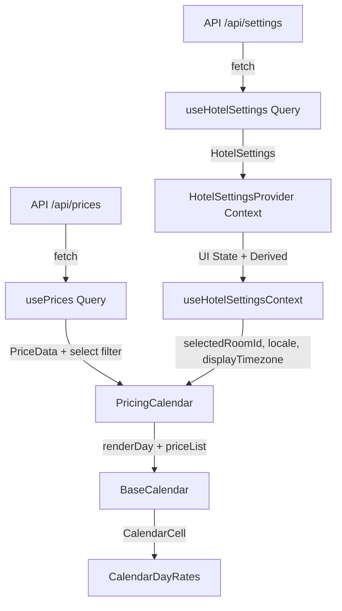

# Dynamic Pricing Calendar

RoomPriceGenie SaaS Revenue Management System — Pricing Calendar simulation built with React, TypeScript, and TanStack Query.

## Tech Stack

- React 18 + TypeScript
- TanStack Query v5
- Mantine UI v7
- Vinxi (Vite + Nitro)
- Zod + date-fns + date-fns-tz + es-toolkit
- pnpm as package manager

## Project Structure

```
client/           # React frontend application
  src/
    components/     # Reusable UI components (BaseCalendar, Layout, ErrorBoundary)
    context/        # HotelSettingsContext (UI state only)
    features/       # Feature modules (OptimizedRates)
    hooks/          # Custom hooks (queries, useCalendar, etc.)
    services/       # API clients (hotel-api)
    types/          # Client-specific Zod schemas and types
    utils/          # Pure utility functions
api/              # Server handlers (Vinxi)
shared/types/     # Shared TypeScript types between client and server
```

## Architecture & Data Flow

**Single Source of Truth**: TanStack Query (`useHotelSettings`, `usePrices`) is the only source of server data.

**UI State**: `HotelSettingsContext` holds ephemeral UI state (`selectedRoomId`, `locale`, `displayTimezone`).

**Derived Values**: Computed via `useMemo` inside the Context Provider (`activeRoomName`, `roomSelectOptions`, `currencySymbol`).

**Data Flow Diagram** (Mermaid):



## Advantages of the Current Solution

- **Single Source of Truth** — TanStack Query owns all server data. Context never duplicates it.
- **Clean Separation** — Context only manages ephemeral UI state (`selectedRoomId`, `locale`).
- **Strong Type Safety** — Zod schemas + shared types + strict TypeScript.
- **Timezone Awareness** — Full user-selectable "Display Timezone" using `date-fns-tz` (`toZonedTime`, `formatInTimeZone`).
- **Error Resilience** — Comprehensive error handling with visible UI feedback, retry mechanisms, and no silent failures.
- **Developer Experience** — Biome formatting, React Query Devtools, descriptive error messages and global error handler.
- **Performance** — `useMemo` for derived values, `query.select` for filtered price data, stable keys.

## Sample

<p align="center">
    
</p>

### Test Suite Blueprint (Sample Showcase)

*Note: These tests serve as a structural sample to demonstrate the testing patterns and architectural compatibility implemented across the workspace.*

- **Hooks Isolation (`useCalendar.test.ts`)** — Validates timezone-aware date calculations, `displayTimezone` propagation, and calendar navigation using `vi.useFakeTimers()`.
- **Component UI Nodes (`BaseCalendar.test.tsx`)** — Tests presentational components with timezone context and error states inside `<MantineProvider>`.
- **Network API Clients (`settings.test.ts`)** — Verifies error handling, serialization, and proper error propagation from API layer.

## Implemented Improvements (Post Take-home Feedback)

- Full **Display Timezone** support using `date-fns-tz` (user can choose their preferred timezone)
- Comprehensive **error handling**: No more silent failures. Clear UI messages, retry buttons, and global error handler.
- `QueryClient` configured with `staleTime`, retry logic, and global `onError`
- Replaced generic "ERR" with descriptive messages ("NO MARKET DATA", "PRICING ERROR")
- Improved API layer to throw meaningful errors instead of returning `null`

## Possible Improvements

- Persist `selectedRoomId`, `locale`, and `displayTimezone` in URL or localStorage
- Add unit tests for pure functions (`getRoomSelectOptions`, `getCurrencyFromLocale`)
- Document the `renderDay` prop contract in `BaseCalendar`
- Extract `PricingCalendar` state into a dedicated `useCalendarDate` hook
- Add visual indicator when user timezone differs from hotel timezone

## Getting Started

**Prerequisites**: Node.js + pnpm

```bash
pnpm install
pnpm dev
```

## Available Scripts

| Script | Description |
|--------|-------------|
| `pnpm dev` | Start development server (Vinxi) |
| `pnpm lint` | Run Biome checks |
| `pnpm lint:fix` | Auto-fix formatting and imports |
| `pnpm typecheck` | Run TypeScript type checking |
| `pnpm test` | Run Tests |
  
## License

MIT — Christian Torrealba
