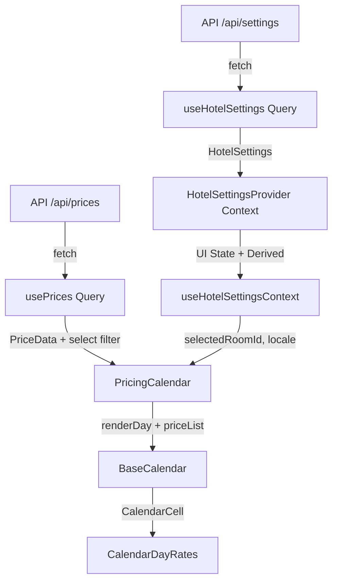

# Dynamic Pricing Calendar

RoomPriceGenie SaaS Revenue Management System — Pricing Calendar simulation built with React, TypeScript, and TanStack Query.

## Tech Stack

- React 18 + TypeScript
- TanStack Query v5
- Mantine UI v7
- Vinxi (Vite + Nitro)
- Zod + date-fns + es-toolkit
- pnpm as package manager

## Project Structure

```
client/           # React frontend application
  components/     # Reusable UI components (BaseCalendar, Layout, ErrorBoundary)
  context/        # HotelSettingsContext (UI state only)
  features/       # Feature modules (OptimizedRates)
  hooks/          # Custom hooks (queries, useCalendar, etc.)
  services/       # API clients (hotel-api)
  types/          # Client-specific Zod schemas and types
  utils/          # Pure utility functions
api/              # Server handlers (Vinxi)
shared/types/     # Shared TypeScript types between client and server
```

## Architecture & Data Flow

**Single Source of Truth**: TanStack Query (`useHotelSettings`, `usePrices`) is the only source of server data.

**UI State**: `HotelSettingsContext` holds only ephemeral UI state (`selectedRoomId`, `locale`, `timezone`).

**Derived Values**: Computed via `useMemo` inside the Context Provider (`activeRoomName`, `roomSelectOptions`, `currencySymbol`).

**Data Flow Diagram** (Mermaid):



## Advantages of the Current Solution

- **Single Source of Truth** — TanStack Query owns all server data. Context never duplicates it.
- **Clean Separation** — Context only manages ephemeral UI state (`selectedRoomId`, `locale`).
- **Strong Type Safety** — Zod schemas + shared types + strict TypeScript.
- **Error Resilience** — `ErrorBoundary` + Query error handling + graceful fallbacks.
- **Developer Experience** — Biome formatting, React Query Devtools, clear error messages.
- **Performance** — `useMemo` for derived values, `query.select` for filtered price data, stable keys.

## Sample

<p align="center">
    
</p>

### Test Suite Blueprint (Sample Showcase)

*Note: These tests serve as a structural sample to demonstrate the testing patterns and architectural compatibility implemented across the workspace.*

- **Hooks Isolation (`useCalendar.test.ts`)** — A sample showcasing how to validate time-dependent state management mechanics, time-locked calculations, and calendar navigation boundaries using `vi.useFakeTimers()` to prevent date-overflow glitches.
- **Component UI Nodes (`BaseCalendar.test.tsx`)** — A sample demonstrating how presentational component integration mapping, interface parameters, and element layouts render while fully bound to the layout context layer inside a `<MantineProvider>`.
- **Network API Clients (`settings.test.ts`)** — A sample verifying serialization, asynchronous data fetcher logic, and mock response validation parameters.

## Possible Improvements

- Add `staleTime` and `gcTime` defaults to `QueryClient` for better cache control.
- Extract `usePrices` filter object into a memoized value or custom hook.
- Add `useCallback` to `handleLocaleChange` if passed deep in the tree.
- Persist `selectedRoomId` and `locale` in `localStorage` or URL for better refresh UX.
- Replace static currency map in `getCurrencyFromLocale` with a more robust `Intl` solution.
- Add unit tests for pure functions (`getRoomSelectOptions`, `getCurrencyFromLocale`).
- Document the `renderDay` prop contract in `BaseCalendar`.
- Extract `PricingCalendar` state (`activeDate`) into a custom hook (`useCalendarDate`).
- Add global `QueryClient` error handler via `queryCache` for consistent logging.

## Getting Started

**Prerequisites**: Node.js + pnpm

```bash
pnpm install
pnpm dev
```

## Available Scripts

| Script | Description |
|--------|-------------|
| `pnpm dev` | Start development server (Vinxi) |
| `pnpm lint` | Run Biome checks |
| `pnpm lint:fix` | Auto-fix formatting and imports |
| `pnpm typecheck` | Run TypeScript type checking |
| `pnpm test` | Run Tests |
  
## License

MIT — Christian Torrealba
